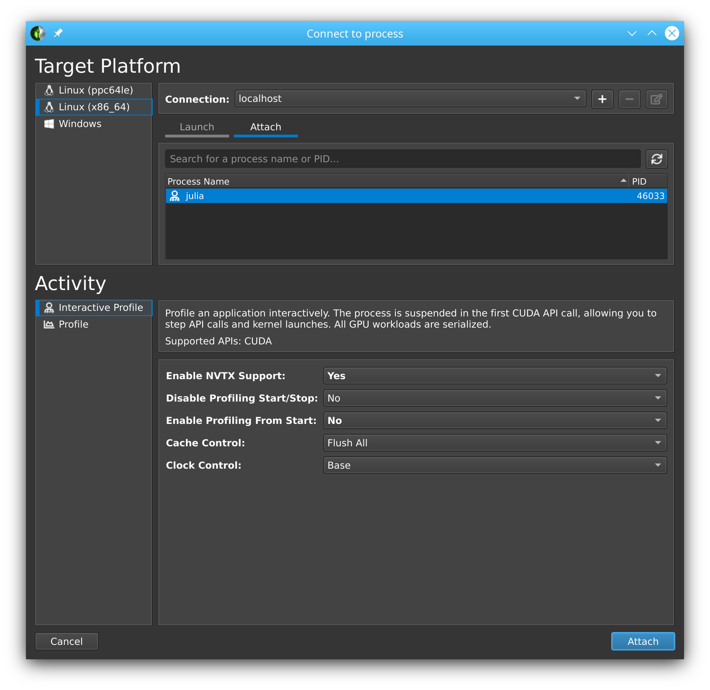
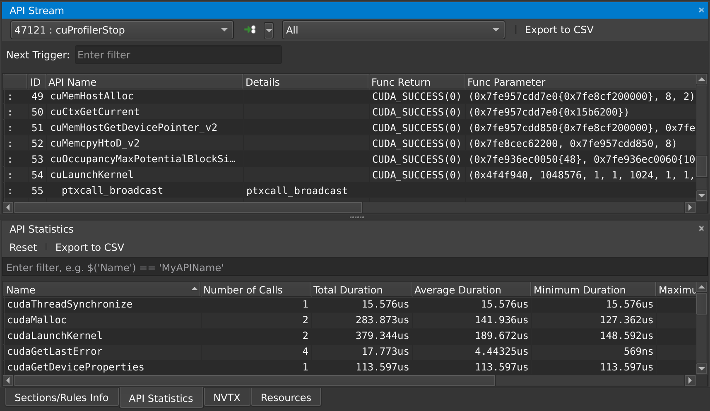

# Benchmarking & profiling

Benchmarking and profiling a GPU program is harder than doing the same for a program
executing on the CPU. For one, GPU operations typically execute asynchronously, and thus
require appropriate synchronization when measuring their execution time. Furthermore,
because the program executes on a different processor, it is much harder to know what is
currently executing. CUDA, and the Julia CUDA packages, provide several tools and APIs to
remedy this.


## Time measurements

To accurately measure execution time in the presence of asynchronously-executing GPU
operations, CUDA.jl provides an `@elapsed` macro that, much like `Base.@elapsed`, measures
the total execution time of a block of code on the GPU:

```julia
julia> a = CUDA.rand(1024,1024,1024);

julia> Base.@elapsed sin.(a)  # WRONG!
0.008714211

julia> CUDA.@elapsed sin.(a)
0.051607586f0
```

This is a low-level utility, and measures time by submitting events to the GPU and measuring
the time between them. As such, if the GPU was not idle in the first place, you may not get
the expected result. The macro is mainly useful if your application needs to know about the
time it took to complete certain GPU operations.

For more convenient time reporting, you can use the `CUDA.@time` macro which mimics
`Base.@time` by printing execution times as well as memory allocation stats, while making
sure the GPU is idle before starting the measurement, as well as waiting for all
asynchronous operations to complete:

```julia
julia> a = CUDA.rand(1024,1024,1024);

julia> CUDA.@time sin.(a);
  0.046063 seconds (96 CPU allocations: 3.750 KiB) (1 GPU allocation: 4.000 GiB, 14.33% gc time of which 99.89% spent allocating)
```

The `CUDA.@time` macro is more user-friendly and is a generally more useful tool when
measuring the end-to-end performance characteristics of a GPU application.

For robust measurements however, it is advised to use the
[BenchmarkTools.jl](https://github.com/JuliaCI/BenchmarkTools.jl) package which goes to
great lengths to perform accurate measurements. Due to the asynchronous nature of GPUs, you
need to ensure the GPU is synchronized at the end of every sample, e.g. by calling
`synchronize()` or, even better, wrapping your code in `CUDA.@sync`:

```julia
julia> a = CUDA.rand(1024,1024,1024);

julia> @benchmark CUDA.@sync sin.($a)
BenchmarkTools.Trial:
  memory estimate:  3.73 KiB
  allocs estimate:  95
  --------------
  minimum time:     46.341 ms (0.00% GC)
  median time:      133.302 ms (0.50% GC)
  mean time:        130.087 ms (0.49% GC)
  maximum time:     153.465 ms (0.43% GC)
  --------------
  samples:          39
  evals/sample:     1
```

Note that the allocations as reported by BenchmarkTools are CPU allocations. For the GPU
allocation behavior you need to consult `CUDA.@time`.


## Application profiling

For profiling large applications, simple timings are insufficient. Instead, we want a
overview of how and when the GPU was active, to avoid times where the device was idle and/or
find which kernels needs optimization.

### Integrated profiler

Once again, we cannot use CPU utilities to profile GPU programs, as they will only paint a
partial picture. Instead, CUDA.jl provides a `CUDA.@profile` macro that separately reports
the time spent on the CPU, and the time spent on the GPU:

```julia
julia> a = CUDA.rand(1024,1024,1024);

julia> CUDA.@profile sin.(a)
Profiler ran for 11.93 ms, capturing 8 events.

Host-side activity: calling CUDA APIs took 437.26 µs (3.67% of the trace)
┌──────────┬───────────┬───────┬───────────┬───────────┬───────────┬─────────────────┐
│ Time (%) │      Time │ Calls │  Avg time │  Min time │  Max time │ Name            │
├──────────┼───────────┼───────┼───────────┼───────────┼───────────┼─────────────────┤
│    3.56% │ 424.15 µs │     1 │ 424.15 µs │ 424.15 µs │ 424.15 µs │ cuLaunchKernel  │
│    0.10% │  11.92 µs │     1 │  11.92 µs │  11.92 µs │  11.92 µs │ cuMemAllocAsync │
└──────────┴───────────┴───────┴───────────┴───────────┴───────────┴─────────────────┘

Device-side activity: GPU was busy for 11.48 ms (96.20% of the trace)
┌──────────┬──────────┬───────┬──────────┬──────────┬──────────┬───────────────────────
│ Time (%) │     Time │ Calls │ Avg time │ Min time │ Max time │ Name                 ⋯
├──────────┼──────────┼───────┼──────────┼──────────┼──────────┼───────────────────────
│   96.20% │ 11.48 ms │     1 │ 11.48 ms │ 11.48 ms │ 11.48 ms │ _Z16broadcast_kernel ⋯
└──────────┴──────────┴───────┴──────────┴──────────┴──────────┴───────────────────────
```

By default, `CUDA.@profile` will provide a summary of host and device activities. If you
prefer a chronological view of the events, you can set the `trace` keyword argument:

```julia
julia> CUDA.@profile trace=true sin.(a)
Profiler ran for 11.71 ms, capturing 8 events.

Host-side activity: calling CUDA APIs took 217.68 µs (1.86% of the trace)
┌────┬──────────┬───────────┬─────────────────┬──────────────────────────┐
│ ID │    Start │      Time │            Name │ Details                  │
├────┼──────────┼───────────┼─────────────────┼──────────────────────────┤
│  2 │  7.39 µs │  14.07 µs │ cuMemAllocAsync │ 4.000 GiB, device memory │
│  6 │ 29.56 µs │ 202.42 µs │  cuLaunchKernel │ -                        │
└────┴──────────┴───────────┴─────────────────┴──────────────────────────┘

Device-side activity: GPU was busy for 11.48 ms (98.01% of the trace)
┌────┬──────────┬──────────┬─────────┬────────┬──────┬─────────────────────────────────
│ ID │    Start │     Time │ Threads │ Blocks │ Regs │ Name                           ⋯
├────┼──────────┼──────────┼─────────┼────────┼──────┼─────────────────────────────────
│  6 │ 229.6 µs │ 11.48 ms │     768 │    284 │   34 │ _Z16broadcast_kernel15CuKernel ⋯
└────┴──────────┴──────────┴─────────┴────────┴──────┴─────────────────────────────────
```

Here, every call is prefixed with an ID, which can be used to correlate host and device
events. For example, here we can see that the host-side `cuLaunchKernel` call with ID 6
corresponds to the device-side `broadcast` kernel.

### External profilers

If you want more details, or a graphical representation, we recommend using external
profilers. To inform those external tools which code needs to be profiled (e.g., to exclude
warm-up iterations or other noninteresting elements) you can also use `CUDA.@profile` to
surround interesting code with:

```julia
julia> a = CUDA.rand(1024,1024,1024);

julia> sin.(a);  # warmup

julia> CUDA.@profile sin.(a);
[ Info: This Julia session is already being profiled; defaulting to the external profiler.

julia>
```

Note that the external profiler is automatically detected, and makes `CUDA.@profile` switch
to a mode where it merely activates an external profiler and does not do perform any
profiling itself. In case the detection does not work, this mode can be forcibly activated
by passing `external=true` to `CUDA.@profile`.

NVIDIA provides two tools for profiling CUDA applications: NSight Systems and NSight Compute
for respectively timeline profiling and more detailed kernel analysis. Both tools are
well-integrated with the Julia GPU packages, and make it possible to iteratively profile
without having to restart Julia.

#### NVIDIA Nsight Systems

Generally speaking, the first external profiler you should use is NSight Systems, as it will
give you a high-level overview of your application's performance characteristics. After
downloading and installing the tool (a version might have been installed alongside with the
CUDA toolkit, but it is recommended to download and install the latest version from the
NVIDIA website), you need to launch Julia from the command-line, wrapped by the `nsys`
utility from NSight Systems:

```
$ nsys launch julia
```

You can then execute whatever code you want in the REPL, including e.g. loading Revise so
that you can modify your application as you go. When you call into code that is wrapped by
`CUDA.@profile`, the profiler will become active and generate a profile output file in
the current folder:

```julia
julia> using CUDA

julia> a = CUDA.rand(1024,1024,1024);

julia> sin.(a);

julia> CUDA.@profile sin.(a);
start executed
Processing events...
Capturing symbol files...
Saving intermediate "report.qdstrm" file to disk...

Importing [===============================================================100%]
Saved report file to "report.qdrep"
stop executed
```

!!! note

    Even with a warm-up iteration, the first kernel or API call might seem to take
    significantly longer in the profiler. If you are analyzing short executions, instead
    of whole applications, repeat the operation twice (optionally separated by a call to
    `synchronize()` or wrapping in `CUDA.@sync`)

You can open the resulting `.qdrep` file with `nsight-sys`:


!!! info

    If NSight Systems does not capture any kernel launch, even though you have used
    `CUDA.@profile`, try starting `nsys` with `--trace cuda`.

#### NVIDIA Nsight Compute

If you want details on the execution properties of a single kernel, or inspect API
interactions in detail, Nsight Compute is the tool for you. It is again possible to use this
profiler with an interactive session of Julia, and debug or profile only those sections of
your application that are marked with `CUDA.@profile`.

First, ensure that all (CUDA) packages that are involved in your application have been
precompiled. Otherwise, you'll end up profiling the precompilation process, instead of
the process where the actual work happens.

Then, launch Julia under the Nsight Compute CLI tool as follows:

```
$ ncu --mode=launch julia
```

You will get an interactive REPL, where you can execute whatever code you want:

```julia
julia> using CUDA
# Julia hangs!
```

As soon as you use CUDA.jl, your Julia process will hang. This is expected, as the tool
breaks upon the very first call to the CUDA API, at which point you are expected to launch
the Nsight Compute GUI utility, select `Interactive Profile` under `Activity`, and attach
to the running session by selecting it in the list in the `Attach` pane:



Note that this even works with remote systems, i.e., you can have NSight Compute connect
over ssh to a remote system where you run Julia under `ncu`.

Once you've successfully attached to a Julia process, you will see that the tool has stopped
execution on the call to `cuInit`. Now check `Profile > Auto Profile` to make Nsight Compute
gather statistics on our kernels, uncheck `Debug > Break On API Error` to avoid halting the
process when innocuous errors happen, and click `Debug > Resume` to resume your application.

After doing so, our CLI session comes to life again, and we can execute the rest of our script:

```julia
julia> a = CUDA.rand(1024,1024,1024);

julia> sin.(a);

julia> CUDA.@profile sin.(a);
```

Once that's finished, the Nsight Compute GUI window will have plenty details on our kernel:


By default, this only collects a basic set of metrics. If you need more information on a
specific kernel, select `detailed` or `full` in the `Metric Selection` pane and re-run
your kernels. Note that collecting more metrics is also more expensive, sometimes even
requiring multiple executions of your kernel. As such, it is recommended to only collect
basic metrics by default, and only detailed or full metrics for kernels of interest.

At any point in time, you can also pause your application from the debug menu, and inspect
the API calls that have been made:




## Source-code annotations

If you want to put additional information in the profile, e.g. phases of your application,
or expensive CPU operations, you can use the NVTX library via the NVTX.jl package:

```julia
using CUDA, NVTX

NVTX.@mark "reached Y"

NVTX.@range "doing X" begin
    ...
end

NVTX.@annotate function foo()
    ...
end
```

For more details, refer to the documentation of the NVTX.jl package.


## Compiler options

Some tools, like NSight Systems Compute, also make it possible to do source-level profiling.
CUDA.jl will by default emit the necessary source line information, which you can disable by
launching Julia with `-g0`. Conversely, launching with `-g2` will emit additional debug
information, which can be useful in combination with tools like `cuda-gdb`, but might hurt
performance or code size.
