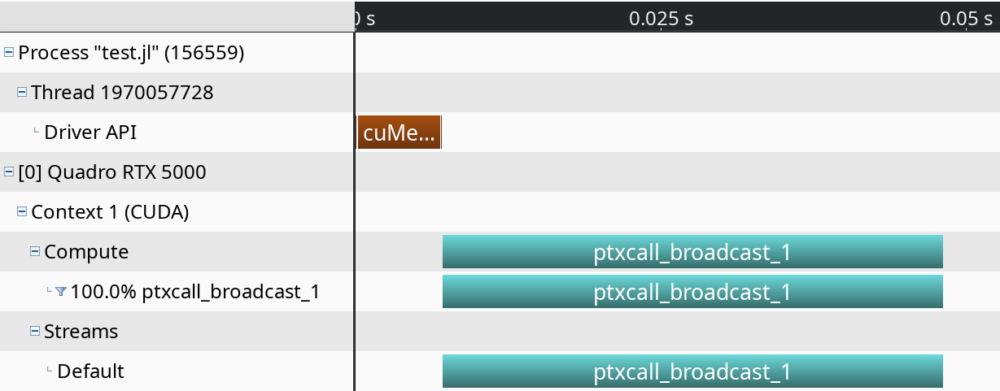

# Profiling

Profiling GPU code is harder than profiling Julia code executing on the CPU. For one,
kernels typically execute asynchronously, and thus require appropriate synchronization when
measuring their execution time. Furthermore, because the code executes on a different
processor, it is much harder to know what is currently executing. CUDA, and the Julia CUDA
packages, provide several tools and APIs to remedy this.


## Time measurements

To accurately measure execution time in the presence of asynchronously-executing kernels,
CUDAdrv.jl provides an `@elapsed` macro that, much like `Base.@elapsed`, measures the total
execution time of a block of code on the GPU:

```julia
julia> a = CuArrays.rand(1024,1024,1024);

julia> Base.@elapsed sin.(a)  # WRONG!
0.008714211

julia> CUDAdrv.@elapsed sin.(a)
0.051607586f0
```

This macro is a low-level utility, assumes the GPU is synchronized before calling, and is
useful if you need execution timings in your application. For most purposes, you should use
`CuArrays.@time` which mimics `Base.@time` by printing execution times as well as memory
allocation stats:

```julia
julia> a = CuArrays.rand(1024,1024,1024);

julia> CuArrays.@time sin.(a);
  0.046063 seconds (96 CPU allocations: 3.750 KiB) (1 GPU allocation: 4.000 GiB, 14.33% gc time of which 99.89% spent allocating)
```

The `@time` macro is more user-friendly (synchronizes the GPU before measuring so you don't
need to do a thing), uses wall-clock time, and is a generally more useful tool when
measuring the end-to-end performance characteristics of a GPU application.

For robust measurements however, it is advised to use the
[BenchmarkTools.jl](https://github.com/JuliaCI/BenchmarkTools.jl) package which goes to
great lengths to perform accurate measurements. Due to the asynchronous nature of GPUs, you
need to ensure the GPU is synchronized at the end of every sample, e.g. by calling
`CUDAdrv.synchronize()`. An easier, and better-performing alternative is to use the `@sync`
macro from the CuArrays.jl package:

```julia
julia> a = CuArrays.rand(1024,1024,1024);

julia> @benchmark CuArrays.@sync sin.($a)
BenchmarkTools.Trial:
  memory estimate:  3.73 KiB
  allocs estimate:  95
  --------------
  minimum time:     46.341 ms (0.00% GC)
  median time:      133.302 ms (0.50% GC)
  mean time:        130.087 ms (0.49% GC)
  maximum time:     153.465 ms (0.43% GC)
  --------------
  samples:          39
  evals/sample:     1
```

Note that the allocations as reported by BenchmarkTools are CPU allocations. For the GPU
allocation behavior you need to consult `CuArrays.@time`.


## Application profiling

For profiling large applications, simple timings are insufficient. Instead, we want a
overview of how and when the GPU was active, to avoid times where the device was idle and/or
find which kernels needs optimization.

As we cannot use the Julia profiler for this task, we will be using external profiling
software as part of the CUDA toolkit. To inform those external tools which code needs to be
profiled (e.g., to exclude warm-up iterations or other noninteresting elements) you can use
the `CUDAdrv.@profile` macro to surround interesting code with. Again, this macro mimics an
equivalent from the standard library, but this time requires external software to actually
perform the profiling:

```julia
julia> a = CuArrays.rand(1024,1024,1024);

julia> sin.(a);  # warmup

julia> CUDAdrv.@profile sin.(a);
┌ Warning: Calling CUDAdrv.@profile only informs an external profiler to start.
│ The user is responsible for launching Julia under a CUDA profiler like `nvprof`.
└ @ CUDAdrv.Profile ~/Julia/pkg/CUDAdrv/src/profile.jl:42
```

### `nvprof` and `nvvp`

For simple profiling, prefix your Julia command-line invocation with the `nvprof` utility.
For a better timeline, be sure to use `CUDAdrv.@profile` to delimit interesting code and
start `nvprof` with the option `--profile-from-start off`:

```
$ nvprof --profile-from-start off julia

julia> using CuArrays, CUDAdrv

julia> a = CuArrays.rand(1024,1024,1024);

julia> sin.(a);

julia> CUDAdrv.@profile sin.(a);

julia> exit()
==156406== Profiling application: julia
==156406== Profiling result:
            Type  Time(%)      Time     Calls       Avg       Min       Max  Name
 GPU activities:  100.00%  44.777ms         1  44.777ms  44.777ms  44.777ms  ptxcall_broadcast_1
      API calls:   56.46%  6.6544ms         1  6.6544ms  6.6544ms  6.6544ms  cuMemAlloc
                   43.52%  5.1286ms         1  5.1286ms  5.1286ms  5.1286ms  cuLaunchKernel
                    0.01%  1.3200us         1  1.3200us  1.3200us  1.3200us  cuDeviceGetCount
                    0.01%     725ns         3     241ns     196ns     301ns  cuCtxGetCurrent
```

For a visual overview of these results, you can use the NVIDIA Visual Profiler (`nvvp`):



Note however that both `nvprof` and `nvvp` are deprecated, and will be removed from future
versions of the CUDA toolkit.

### NVIDIA Nsight Systems

Following the deprecation of above tools, NVIDIA published the Nsight Systems and Nsight
Compute tools for respectively timeline profiling and more detailed kernel analysis. The
former is well-integrated with the Julia GPU packages, and makes it possible to iteratively
profile without having to restart Julia as was the case with `nvvp` and `nvprof`.

After downloading and installing NSight Systems (a version might have been installed
alongside with the CUDA toolkit, but it is recommended to download and install the latest
version from the NVIDIA website), you need to launch Julia from the command-line, wrapped by
the `nsys` utility from NSight Systems:

```
$ nsys launch -t cuda,cublas,cudnn,nvtx julia
```

You can then execute whatever code you want in the REPL, including e.g. loading Revise so
that you can modify your application as you go. When you call into code that is wrapped by
`CUDAdrv.@profile`, the profiler will become active and generate a profile output file in
the current folder:

```julia
julia> using CuArrays, CUDAdrv

julia> a = CuArrays.rand(1024,1024,1024);

julia> sin.(a);

julia> CUDAdrv.@profile sin.(a);
start executed
Processing events...
Capturing symbol files...
Saving intermediate "report.qdstrm" file to disk...

Importing [===============================================================100%]
Saved report file to "report.qdrep"
stop executed
```

You can open the resulding `.qdrep` file with `nsight-sys`:


## Source-code annotations

If you want to put additional information in the profile, e.g. phases of your application,
or expensive CPU operations, you can use the NVTX library. Wrappers for this library are
included in recent versions of CUDAnative:

```julia
using CUDAnative, CUDAnative.NVTX

@range "doing X" begin
    ...
end

@mark "reached Y"
```


## Compiler options

Some tools, like `nvvp` and NSight Systems Compute, also make it possible to do source-level
profiling. CUDAnative will by default emit the necessary source line information, which you
can disable by launching Julia with `-g0`. Conversely, launching with `-g2` will emit
additional debug information, which can be useful in combination with tools like `cuda-gdb`,
but might hurt performance or code size.
