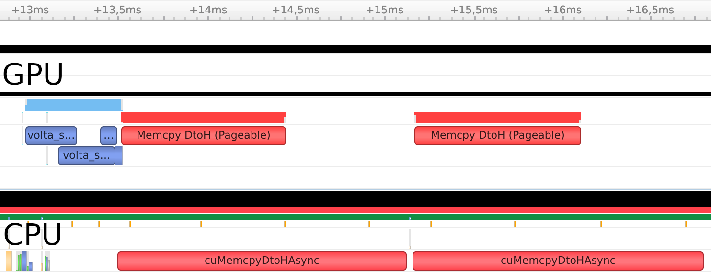
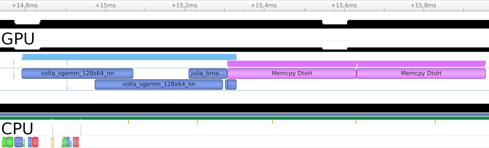

# Tasks and threads

CUDA.jl can be used with Julia tasks and threads, offering a convenient way to work with
multiple devices, or to perform independent computations that may execute concurrently on
the GPU.


## Task-based programming

Each Julia task gets its own local CUDA execution environment, with its own stream, library
handles, and active device selection. That makes it easy to use one task per device, or to
use tasks for independent operations that can be overlapped. At the same time, it's
important to take care when sharing data between tasks.

For example, let's take some dummy expensive computation and execute it from two tasks:

```julia
# an expensive computation
function compute(a, b)
    c = a * b             # library call
    broadcast!(sin, c, c) # Julia kernel
    c
end

function run(a, b)
    results = Vector{Any}(undef, 2)

    # computation
    @sync begin
        @async begin
            results[1] = Array(compute(a,b))
            nothing # JuliaLang/julia#40626
        end
        @async begin
            results[2] = Array(compute(a,b))
            nothing # JuliaLang/julia#40626
        end
    end

    # comparison
    results[1] == results[2]
end
```

We use familiar Julia constructs to create two tasks and re-synchronize afterwards (`@async`
and `@sync`), while the dummy `compute` function demonstrates both the use of a library
(matrix multiplication uses CUBLAS) and a native Julia kernel. The function is passed three
GPU arrays filled with random numbers:

```julia
function main(N=1024)
    a = CUDA.rand(N,N)
    b = CUDA.rand(N,N)

    # make sure this data can be used by other tasks!
    synchronize()

    run(a, b)
end
```

The `main` function illustrates how we need to take care when sharing data between tasks:
GPU operations typically execute asynchronously, queued on an execution stream, so if we
switch tasks and thus switch execution streams we need to `synchronize()` to ensure the data
is actually available.

Using Nsight Systems, we can visualize the execution of this example:



You can see how the two invocations of `compute` resulted in overlapping execution. The
memory copies, however, were executed in serial. This is expected: Regular CPU arrays cannot
be used for asynchronous operations, because their memory is not page-locked. For most
applications, this does not matter as the time to compute will typically be much larger than
the time to copy memory.

If your application needs to perform many copies between the CPU and GPU, it might be
beneficial to "pin" the CPU memory so that asynchronous memory copies are possible. This
operation is expensive though, and should only be used if you can pre-allocate and re-use
your CPU buffers. Applied to the previous example:

```julia
function run(a, b)
    results = Vector{Any}(undef, 2)

    # pre-allocate and pin destination CPU memory
    results[1] = CUDA.pin(Array{eltype(a)}(undef, size(a)))
    results[2] = CUDA.pin(Array{eltype(a)}(undef, size(a)))

    # computation
    @sync begin
        @async begin
            copyto!(results[1], compute(a,b))
            nothing # JuliaLang/julia#40626
        end
        @async begin
            copyto!(results[2], compute(a,b))
            nothing # JuliaLang/julia#40626
        end
    end

    # comparison
    results[1] == results[2]
end
```



The profile reveals that the memory copies themselves could not be overlapped, but the first
copy was executed while the GPU was still active with the second round of computations.
Furthermore, the copies executed much quicker -- if the memory were unpinned, it would first
have to be staged to a pinned CPU buffer anyway.


## Multithreading

Use of tasks can be easily extended to multiple threads with functionality from the Threads
standard library:

```julia
function run(a, b)
    results = Vector{Any}(undef, 2)

    # computation
    @sync begin
        Threads.@spawn begin
            results[1] = Array(compute(a,b))
            nothing # JuliaLang/julia#40626
        end
        Threads.@spawn begin
            results[2] = Array(compute(a,b))
            nothing # JuliaLang/julia#40626
        end
    end

    # comparison
    results[1] == results[2]
end
```

By using the `Threads.@spawn` macro, the tasks will be scheduled to be run on different CPU
threads. This can be useful when you are calling a lot of operations that "block" in CUDA,
e.g., memory copies to or from unpinned memory. The same result will occur when using a
`Threads.@threads for ... end` block. Generally, though, operations that
synchronize GPU execution (including the call to `synchronize` itself) are implemented in a
way that they yield back to the Julia scheduler, to enable concurrent execution without
requiring the use of different CPU threads.

!!! warning

    Use of multiple threads with CUDA.jl is a recent addition,
    and there may still be bugs or performance issues.
